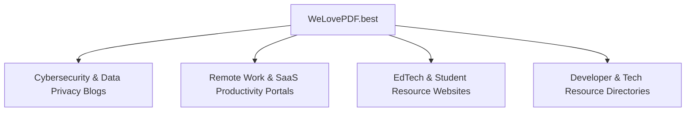

# 🔗 WeLovePDF.best — Complete Backlink Strategy & Competitor Link Gap Plan

> **Domain:** `https://www.welovepdf.best`  
> **Target Niche:** Free Online PDF Tools, Data Security, Remote Work & EdTech Productivity  
> **Core Value Proposition:** 100% Client-side WebAssembly processing — zero file uploads, 100% private.

---

## 🛠️ Section 1: Free Backlink API Setup Guide

`claude-seo` supports 3 free data sources for analyzing backlink profiles without paid subscriptions:

### 1. Moz API (Free Tier) — Domain Authority & Referring Domains
- **What it provides:** Domain Authority (DA), Page Authority (PA), Spam Score, and linking root domains.
- **Setup Command:**
  ```bash
  seo backlinks setup
  ```
- **Registration:** Sign up for a free Moz API account at [moz.com/api](https://moz.com/api) (Free plan provides 2,500 rows/month).
- **Add credentials:** Set `MOZ_ACCESS_ID` and `MOZ_SECRET_KEY` in environment variables or `~/.config/claude-seo/backlinks.json`.

### 2. Bing Webmaster Tools (Free) — Verified Inbound Links
- **What it provides:** Real inbound links indexed by Bing Bingbot with anchor text details.
- **Setup:** Verify `https://www.welovepdf.best` in [Bing Webmaster Tools](https://www.bing.com/webmasters) and generate a free API key.

### 3. Common Crawl (Built-in — Always Free)
- **What it provides:** Global web graph analysis and PageRank presence metrics (no setup required).

---

## 🎯 Section 2: High-Authority Target Niches for WeLovePDF

To gain high-quality, contextual `dofollow` backlinks, focus outreach on these 4 high-authority website categories:



| Niche | Target Site Types | Value Proposition / Hook | Link Type |
|---|---|---|---|
| **Cybersecurity & Privacy** | Privacy-focused blogs, InfoSec portals, VPN blogs | "Why server-side PDF converters pose data leak risks and how client-side WebAssembly solves it." | Editorial Contextual Link |
| **Productivity & Remote Work** | Remote work tools directories, freelance portals, HR blogs | "Top free browser-based utilities for remote teams that don't lock features behind paywalls." | Resource List / Roundup Link |
| **Education & Students** | College student blogs, study hacks sites, academic resource guides | "Free PDF compression and merging tools for students with no daily caps or watermarks." | Student Resource Guide Link |
| **Tech Directories & Tool Lists** | ProductHunt, Alternativeto.net, Softpedia, Chrome Web Store | Free online PDF utility suite listing with zero login requirement. | Directory / Profile Link |

---

## 🚀 Section 3: 5 Proven White-Hat Link Building Tactics

### Tactic 1: Competitor Broken Link Building & Alternatives Outreach
- **Strategy:** Identify broken links or outdated reviews pointing to legacy PDF tools (e.g. Smallpdf, PDF2Go, Sejda).
- **Action:** Pitch WeLovePDF as the modern, zero-upload alternative.
- **Command:**
  ```bash
  seo backlinks gap https://www.welovepdf.best https://www.ilovepdf.com
  ```

### Tactic 2: Privacy-First Feature Pitching (Thought Leadership)
- **Strategy:** Write technical guest posts explaining how browser sandboxing (WebAssembly + PDF.js) keeps confidential financial/legal documents safe compared to uploading to third-party cloud servers.

### Tactic 3: Free Tool Directory Submissions
- Submit `https://www.welovepdf.best` to free software directories:
  - AlternativeTo (`alternativeto.net/software/welovepdf`)
  - Product Hunt
  - Hacker News / Show HN
  - Reddit (`r/Productivity`, `r/Privacy`, `r/UsefulWebsites`)
  - WebAppRater / SaaSHub

### Tactic 4: Educational Resource Link Building (.edu & Student Blogs)
- Reach out to university career centers and student resource pages that list "Free Student Tools" to get listed under PDF/Document Utilities.

### Tactic 5: Infographic & Visual Asset Outreach
- Create visual infographics explaining "How PDF Compression Works Client-Side vs Cloud Server Processing" and allow tech bloggers to embed it with an attribution link.

---

## 📁 Generated Deliverables in this Package

1. 📄 **Outreach Email Kit**: [`OUTREACH-KIT.md`](file:///e:/WeLovePDF/welovepdf.best-backlinks/OUTREACH-KIT.md)
2. 📝 **Guest Post Article 1 (Privacy & Tech)**: [`guest-posts/guest-post-privacy-pdf.md`](file:///e:/WeLovePDF/welovepdf.best-backlinks/guest-posts/guest-post-privacy-pdf.md)
3. 📝 **Guest Post Article 2 (Productivity & EdTech)**: [`guest-posts/guest-post-productivity-tools.md`](file:///e:/WeLovePDF/welovepdf.best-backlinks/guest-posts/guest-post-productivity-tools.md)
